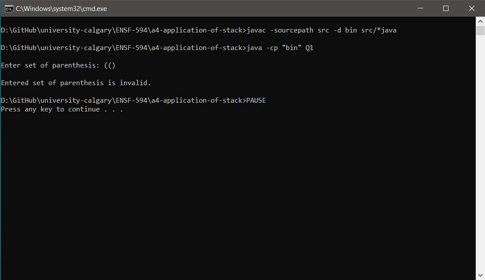
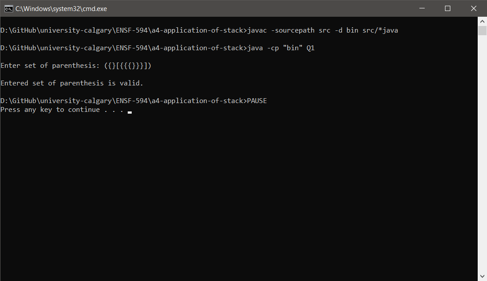
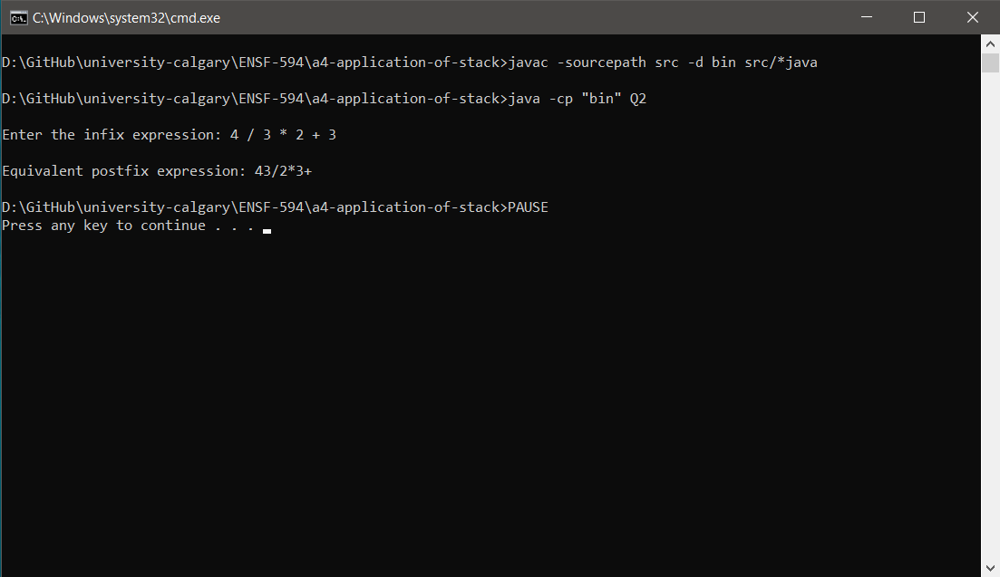
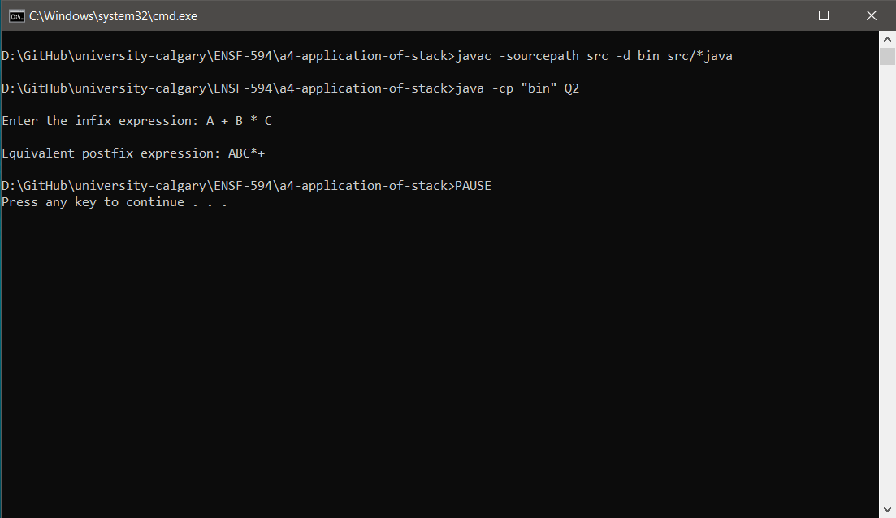
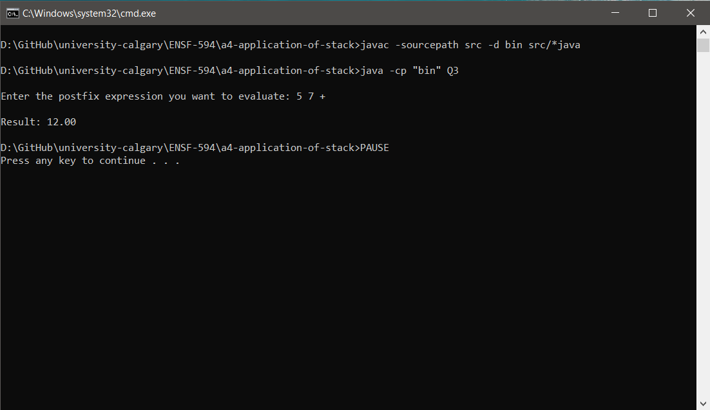
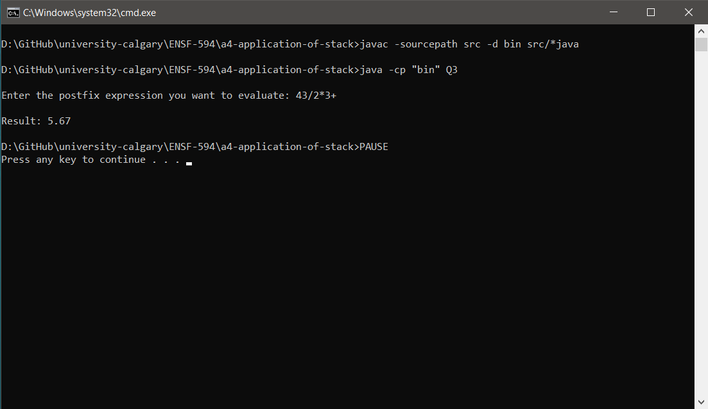

# Application of Stack

These programs are the solution to the problem statements given in the file [Questions.pdf](Questions.pdf).


## Dependencies

+ JDK 1.7 or above


## How to run

1. Clone the project on your local machine or extract the downloaded the zip archive

1. If using *nix OS
   1. Using the terminal, go to the directory where the project is cloned/extracted
   1. Run the below command
      ```shell
      chmod +x q*_launch.sh
      ```
   1. To run the problem statement on bracket matching, run the below command
      ```shell
      ./q1_launch.sh
      ```
   1. To run the problem statement on infix to postfix conversion, run the below command
      ```shell
      ./q2_launch.sh
      ```
   1. To run the problem statement on evaluation of postfix expression, run the below command
      ```shell
      ./q3_launch.sh
      ```
   1. Then follow the onscreen instructions, if any

1. If using Windows OS
   1. Navigate to the directory where the project is cloned/extracted
   1. To run the problem statement on bracket matching, double click on the file ```q1_launch.cmd```
   1. To run the problem statement on infix to postfix conversion, double click on the file ```q2_launch.cmd```
   1. To run the problem statement on evaluation of postfix expression, double click on the file ```q3_launch.cmd```
   1. Follow the onscreen instructions, if any


## Execution Screenshots

### Snips for Question 1

1. Matching parenthesis  

   

1. Matching other brackets  

   

### Snips for Question 2

1. Numerical input  

   

1. Character input  

   

### Snips for Question 3

1. Simple input  

   

1. Output from Question 2 as input  

   
